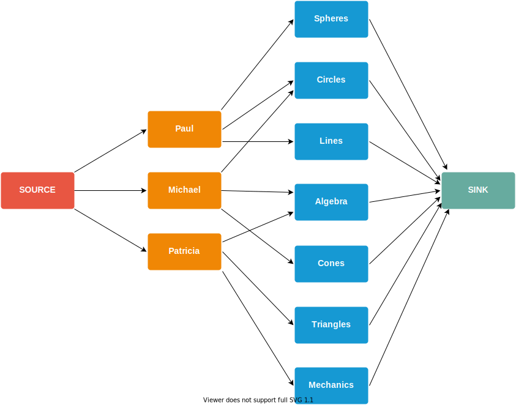

# alloa
Project allocation software, written in Python 3.8.5.

At the University of Glasgow, mathematics students must do an undergraduate 
project (dissertation) in 4th year. This software automates the laborious 
process of assigning projects to students.

We represent each student/project/academic as agents within hierarchies (level 1
for students, level 2 for projects, level 3 for academics). Each agent has an 
(ordered) list of preferences of agents at the next higher level. 
Specifically, this means that each student has a list of projects they want to 
do, and each project has a list of academics that are suited to supervising it.

The algorithm assigns students to projects by minimising unhappiness; that is,
we minimise the occurrence of situations where students are assigned projects 
they give a low preference rating to. This algorithm is a variant of SPA as in
http://www.sciencedirect.com/science/article/pii/S1570866706000207

# A very simple example
## Agents and hierarchies

Three students Paul, Michael and Patricia each have a list of three projects
they'd like to work on, ordered by preference
```
Paul:     [Spheres, Circles, Lines]
Michael:  [Circles, Algebra, Cones]
Patricia: [Triangles, Mechanics, Algebra]
```
Then 

```Paul, Michael, Patricia```

would be represented by three agent
objects at a level 1 hierarchy, and the projects

```Spheres, Circles, Lines, Algebra, Cones, Triangles, Mechanics, Algebra```

would be represented by eight agent objects at a level 2 hierarchy.

## The allocation graph
The two inner columns indicate the level 1 and level 2 hierarchies.



## The agent nodes of the hierarchy graph
Suppose project `Spheres` has upper capacity 2 and lower capacity 1, meaning it 
must have either 1 or 2 students working on it. Then:
```
capacity = upper_capacity - lower_capacity = 2 - 1 = 1.
```
The positive agent node has demand 1, and the negative node has demand -1.


# How to run
It is recommended to create a custom Python environment, using a tool like
[virtualenv](https://virtualenv.pypa.io/en/stable/) or 
[miniconda](https://docs.conda.io/en/latest/miniconda.html) /
[anaconda](https://www.anaconda.com/). Make sure the latest version of 
`networkx` is installed on your local Python environment.

Type ```python alloa.py``` in the command line which will take the projects, 
students, academics files in the `/input` folder and generate the allocation. 
You may need to install the networkx library. The `allocation_*` files in
`/output` are the outputs of the program. The input and output directories can
be specified in `alloa.conf`.
